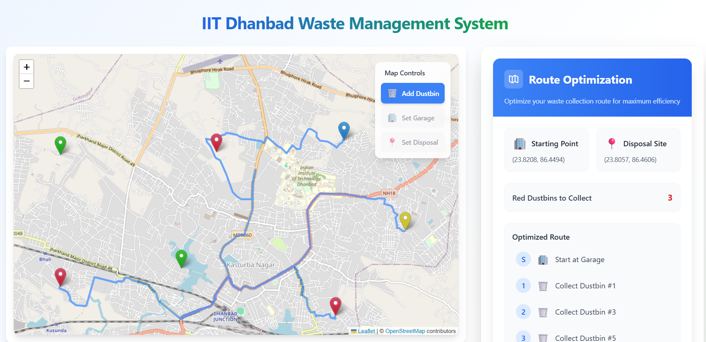
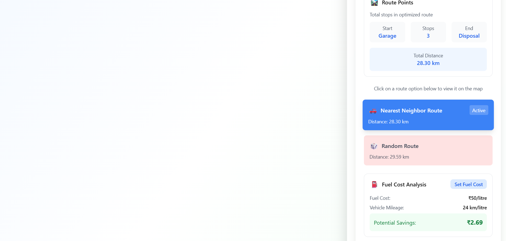

# IoT-Based Solid Waste Management System

An intelligent, IoT-simulation dashboard for optimized solid waste collection at **IIT (ISM) Dhanbad** campus. The system monitors dustbin fill levels and computes fuel-efficient truck routes in real time on an interactive map.

---

## Features

| Feature | Description |
|---|---|
| **Interactive Map** | Place dustbins, a garage (start), and a disposal site (end) on the real IIT Dhanbad campus map |
| **Dustbin Status Toggle** | Mark each dustbin as full or empty — simulating IoT sensor input |
| **Nearest Neighbor Routing** | Greedy TSP heuristic that finds the shortest path through all full dustbins using real road distances |
| **Alternative Route Comparison** | Generates an unoptimized random-order route to demonstrate fuel/time savings |
| **Fuel Cost Calculator** | Calculates rupee savings from using the optimized route vs. the traditional route |
| **Live Status Dashboard** | Real-time counts of total/full dustbins and infrastructure status |

---

## Tech Stack

| Layer | Technology | Version |
|---|---|---|
| Framework | Next.js (App Router) | 16.x |
| UI | React | 19.x |
| Map | Leaflet.js + React Leaflet | 1.9.x / 5.x |
| Map Tiles | OpenStreetMap | — |
| Road Routing | OSRM Public API | — |
| Animations | tsParticles | 2.x |
| Styling | Tailwind CSS | 3.x |
| Language | JavaScript (ES2022) | — |

> **Architecture:** Purely frontend — no backend, no database. All state managed in React. External calls only to OSRM (routing) and OSM (tiles).

---

## Algorithms

| Algorithm | Complexity | Role |
|---|---|---|
| Nearest Neighbor Heuristic | O(N²) | Primary TSP approximation for optimized route |
| Floyd-Warshall | O(N³) | All-pairs shortest path (implemented in codebase) |
| Fisher-Yates Shuffle | O(N) | Uniform random permutation for alternative route generation |

---

## Architecture

```
app/
├── page.js              ← Root component; owns all application state
├── layout.js            ← HTML shell, font loading
├── globals.css          ← Tailwind directives + global overrides
└── components/
    ├── Map.js           ← Leaflet map, marker placement, polyline rendering, click handling
    ├── MapWrapper.js    ← Dynamic import wrapper (ssr: false) to prevent Leaflet SSR crash
    └── RouteOptimizer.js← TSP algorithms, OSRM API integration, sidebar UI, fuel calculator
```

**Key design decisions:**
- Leaflet requires browser APIs (`window`, `document`) unavailable during Next.js SSR → wrapped in `next/dynamic` with `ssr: false`
- All routing uses real road geometry via OSRM's `/route` endpoint rather than straight-line (haversine) distance, giving accurate km and travel-time estimates
- State is colocated in `page.js` and passed down as props — no global store needed at this scale

---

## Getting Started

```bash
npm install
npm run dev
```

Open [http://localhost:3000](http://localhost:3000).

### Usage
1. **Set Garage** → click map to place truck start point
2. **Set Disposal** → click map to place disposal site
3. **Add Dustbin** (default mode) → place dustbins on map
4. Click a dustbin marker → **Toggle Status** to mark it full (red)
5. **Calculate Route** → optimized route renders in blue
6. Switch to **Random Route** to compare fuel/distance savings
7. Enter fuel cost and mileage for exact ₹ savings

---

## Sample Output



